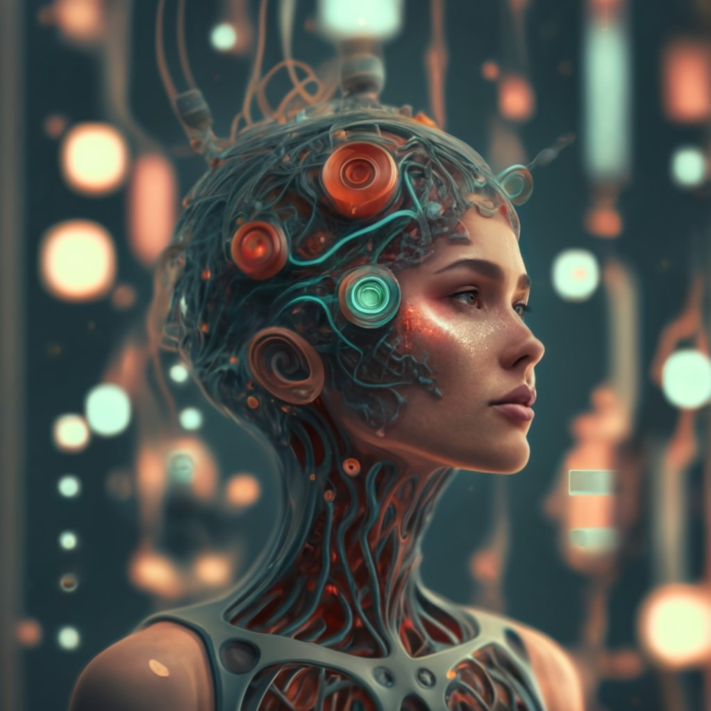
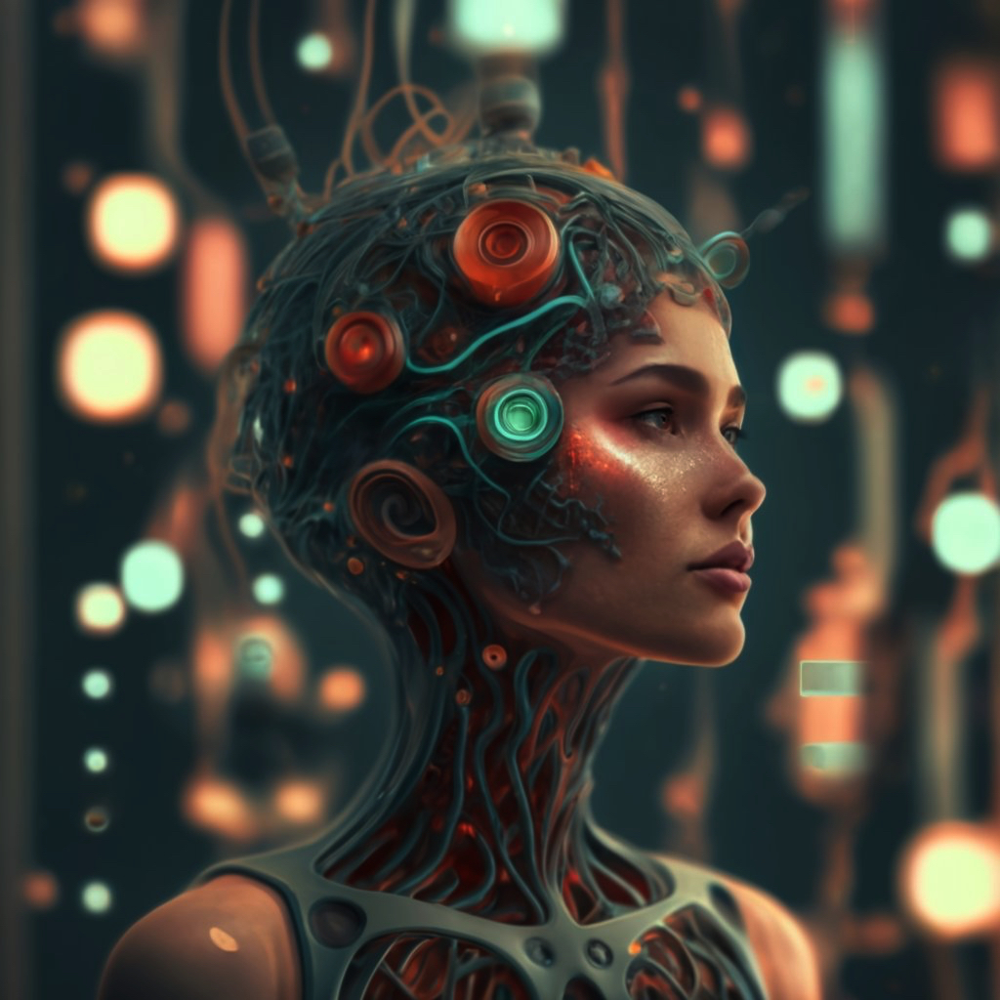

# rgb_filter
different rib filters implemented in python 

## Image Processing Script with Various Filters

This script allows you to apply various filters to an image file. 


   Input       |   output    |
|--------------|-------------|
||

###  Installation

This script requires the following Python libraries:

* numpy
* Pillow (PIL Fork)
* argparse

You can install these libraries using the following command:

```bash
pip install -r requirements.txt
```

### Usage

```bash
python main.py [image_file] [options]
```

**Arguments**

* `image_file`: Path to the image file you want to process.
* `-o`, `--output`: (Optional) Path to save the processed image. Defaults to `img/[original_filename]`.

**Filter Options**

* `-g`, `--grayscale`: Convert the image to grayscale.
* `-b`, `--blur`: Apply a blur filter (specify kernel size with an integer argument). Defaults to kernel size 3.
* `-hr`, `--horizontal_ref`: Apply horizontal reflection (mirror image left to right).
* `-vr`, `--vertical_ref`: Apply vertical reflection (mirror image top to bottom).
* `-lf`, `--lofi`: Apply lo-fi filter (specify blur radius, noise factor, and color depth as comma-separated floats). Defaults to (0.1, 8, 0.8).
* `-a`, `--amaro`: Apply Amaro filter (vintage style with cooler tones).
* `-s`, `--sepia`: Apply sepia filter (simulate an aged photo).
* `-e`, `--enhance`: Enhance image warmth (specify warmth factor as a float). Defaults to 1.2.
* `-n`, `--negative`: Convert image to negative (invert colors).
* `-p`, `--positive`: Convert image back to positive (use after negative filter).
* `-ul`, `--up_low`: Apply up-low filter (increase highlights and shadows).
* `-mu`, `--max_up`: Apply max-up filter (similar to up-low but stronger).
* `-ml`, `--min_low`: Apply min-low filter (similar to up-low but weaker).
* `-v`, `--vintage`: Apply vintage filter (specify warmth, saturation, contrast, and noise as comma-separated floats). Defaults to (1.2, 0.8, 0.8, 0.05).
* `-vi`, `--vignetting`: Apply vignetting effect (darken image corners; specify intensity as a float). Defaults to 0.8.
* `-w`, `--warmth`: Increase image warmth (specify warmth factor as a float). Defaults to 1.2.
* `-gr`, `--grain`: Add grain to the image (simulate film grain; specify intensity as a float). Defaults to 0.05.
* `-f`, `--faded`: Apply faded effect (reduce color saturation; specify intensity as a float). Defaults to 0.8.

**Note:**

* You can only specify one filter from the following group: `grayscale`, `blur`, `horizontal_ref`, `vertical_ref`.
* You can combine other filters together.
* At least one filter option must be provided.

### Example Usage

```bash
python main.py my_image.jpg -g -o output_image.jpg
```

This command applies the grayscale filter to the image `my_image.jpg` and saves the processed image as `output_image.jpg`.

```bash
python main.py my_image.jpg -lf 0.2,5,0.7 -v 1.3,0.7,0.9,0.1
```

This command applies a lo-fi filter with blur radius 0.2, noise factor 5, and color depth 0.7, followed by a vintage filter with warmth 1.3, saturation 0.7, contrast 0.9, and noise 0.1 to the image `my_image.jpg`.
